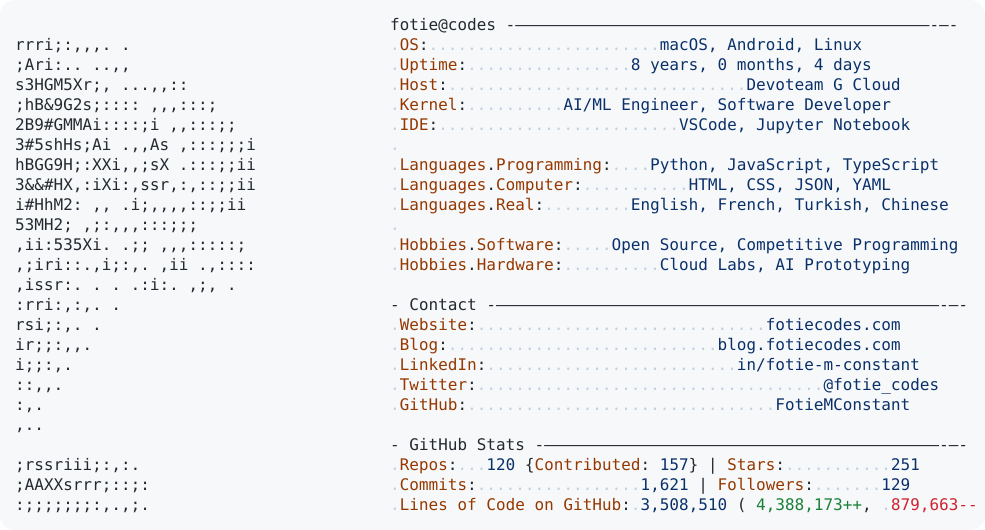

<a href="https://github.com/FotieMConstant/FotieMConstant">
  <picture>
    <source media="(prefers-color-scheme: dark)" srcset="assets/profile-dark.svg">
    
  </picture>
</a>

 

I started contributing to open source in May 2020. [Take a look at my first pull request](https://github.com/fbdevelopercircles/FbDevcCommunityContent/pull/142)

### Open-source contributions

- [Scalar](https://github.com/scalar/scalar)
- [Kokoro-FastAPI](https://github.com/remsky/Kokoro-FastAPI)
- [node-pesa](https://github.com/openpesa/node-pesa)
- [Handy](https://github.com/cjpais/Handy)

### Projects

- [OpenMind](https://github.com/codewithbro95/openmind)
- [Support tickets classification](https://github.com/FotieMConstant/support-tickets-classification)
- [Emotions in text classification](https://github.com/FotieMConstant/emotions-in-text-classification)
- [J.A.R.V.I.S](https://github.com/clevaway/J.A.R.V.I.S)
- [Bond](https://github.com/clevaway/bond)
- [Applemojis](https://github.com/FotieMConstant/applemojis)
- [Screel](https://github.com/FotieMConstant/screel)
- [Geek Quote API](https://github.com/FotieMConstant/geek-quote-api)
- [LAN-Tube](https://github.com/FotieMConstant/LAN-Tube)
- [Revind](https://github.com/FotieMConstant/revind)
- [4Selfie](https://github.com/FotieMConstant/4Selfie)
- [Metal-Fighters](https://github.com/FotieMConstant/Metal-Fighters)

### Community

- Google Developer Group Yaoundé
- Facebook Developer Circles Yaoundé
- Open Source Society Cameroon
- Student Community Ambassador at OpenClassrooms
